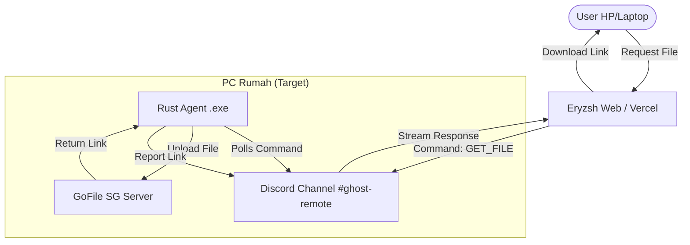

# 🏗️ Eryzsh Dashboard & Toolkit


**Eryzsh** adalah personal dashboard "Over-Engineered" yang menggabungkan manajemen kuliah, _tools_ Teknik Sipil canggih, dan sistem _Database-as-a-Service_ (DBaaS) berbasis Discord.

Dilengkapi dengan **Ghost Bridge**, sistem _remote file access_ berbasis Rust yang memungkinkan akses file PC rumah dari mana saja tanpa IP publik.

---

## 🚀 Fitur Utama

### 1. 👻 Ghost Bridge (Remote Access)

Sistem jembatan antara Web (Vercel) dan PC Rumah (Localhost) menggunakan Discord sebagai _Command & Control_ (C2) dan GoFile sebagai CDN.

- **Agent (Rust):** Program _headless_ ultra-ringan (<10MB RAM) yang berjalan di PC target.
- **Protocol:** Polling smart interval (2s online / 25s offline).
- **Auto-Update:** Dilengkapi fitur cek versi otomatis dan _self-updating_ via PowerShell.
- **Storage:** Integrasi **GoFile Premium (Singapore Node)** untuk transfer file besar tanpa batas _bandwidth_.
- **Privacy:** Komunikasi terenkripsi via HTTPS dan Discord API.

### 2. 👾 Discord DBaaS (Database)

Mengubah Discord menjadi database NoSQL unlimited gratis.

- **CRUD Operasi:** Create, Read, Update, Delete data JSON via Discord Channel.
- **Storage:** Menyimpan file/aset biner sebagai _attachment_ Discord.
- **Caching:** Implementasi _Server-Side Caching_ untuk performa kencang.

### 3. 📐 Civil Engineering Tools

Kumpulan alat bantu hitung untuk mahasiswa Teknik Sipil:

- **Kontur & Trase Jalan:** Visualisasi peta kontur dari data grid elevasi.
- **Mekban Solver:** Kalkulator SFD (Shear Force) & BMD (Bending Moment) untuk balok sederhana.
- **Jembatan Balsa Simulator:** Simulasi beban dan lendutan rangka batang.
- **IUT Calculator:** Hitungan Poligon & Azimuth otomatis.

### 4. 📸 Photo Formatter

- **Docx Generator:** Convert foto dokumentasi lapangan (ZIP) menjadi laporan DOCX rapi dengan penomoran otomatis.
- **Compression:** Kompresi gambar _client-side_ sebelum upload.

---

## 🛠️ Arsitektur Ghost Bridge



---

## 💻 Tech Stack

### Frontend & Core

- **Framework:** Next.js 15 (App Router)
- **Language:** TypeScript
- **Styling:** Tailwind CSS v4 + Shadcn UI
- **Animations:** GSAP & Framer Motion

### Ghost Agent (Backend Service)

- **Language:** Rust 🦀
- **Libraries:** `tokio`, `reqwest`, `serde`
- **Build Target:** Windows (`x86_64-pc-windows-msvc`)

### Storage & Infra

- **Database:** Discord Text Channels
- **File CDN:** GoFile API (Premium/Token Auth) & Discord Attachments
- **Hosting:** Vercel (Web)

---

## ⚙️ Cara Setup (Development)

### 1. Web (Next.js)

Jalankan script setup otomatis (Interactive Mode):

```bash
bun run setup
```

Script ini akan memandu Anda untuk:

1.  Menginstal dependencies (`bun install`).
2.  Mengisi Environment Variables (`.env.local`).
3.  Menjalankan Development Server (`bun dev`).

Jika Anda ingin melakukan simulasi setup tanpa perubahan sistem:

```bash
bun run setup test
```

### 2. Environment Variables

Pastikan variabel berikut terisi (akan dipandu oleh setup script):

```env
DISCORD_BOT_TOKEN=...
DISCORD_WEBHOOK_URL=...
CHECKLIST_CHANNEL_ID=...
GEMINI_API_KEY=...
QSTASH_URL=...
QSTASH_TOKEN=...
```

### 2. Rust Agent (Ghost)

Masuk ke folder `ghost-agent`:

```bash
cd ghost-agent

# Run (Debug mode - Terminal muncul)
cargo run

# Build untuk Production (Headless/No Terminal)
# Pastikan flag #![windows_subsystem = "windows"] di main.rs aktif
cargo build --release
```

Hasil build ada di `target/release/erzysh_ghost.exe`.

---

## ⚠️ Disclaimer

Proyek ini dibuat untuk tujuan edukasi dan penggunaan pribadi (Personal Cloud). Penggunaan **Discord** sebagai database mungkin melanggar ToS jika digunakan secara _abusive_ (spam request). Gunakan dengan bijak.

---

**© 2025 Rizqi Lasheva. Made with ☕ and Code.**
